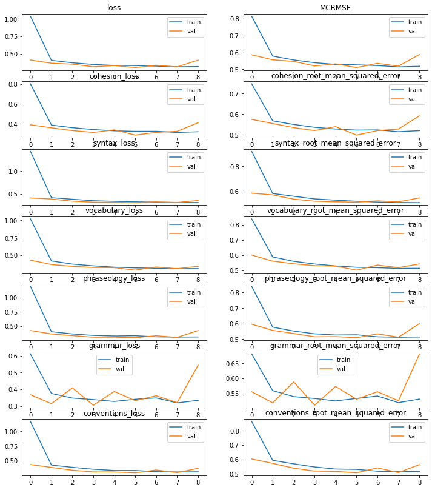
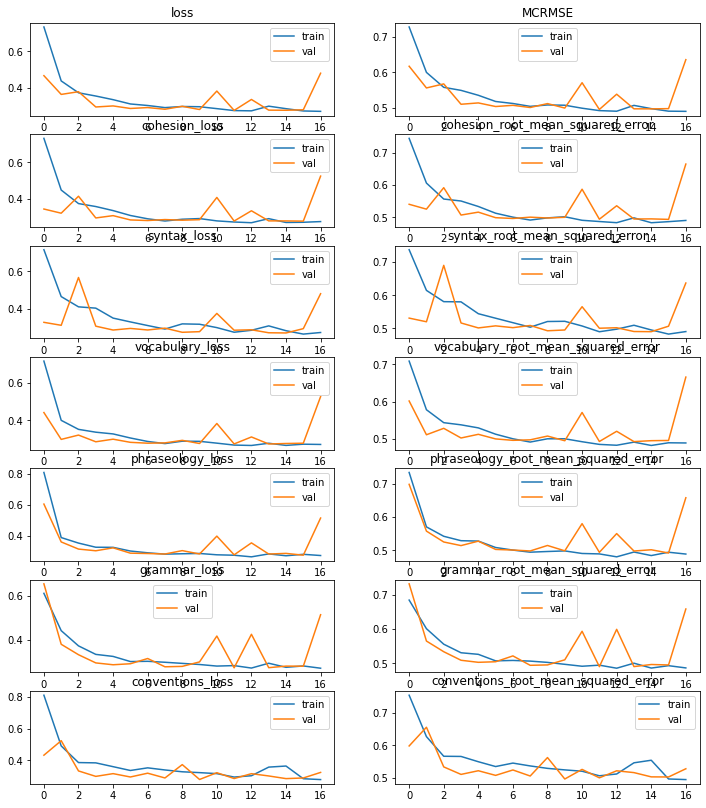

# __AI Powered Language Testing__

The goal of this project is to build a model that is able to score a text on a scale from 1 to 5 with respect to 6 language criteria : cohesion, syntax, vocabulary, phraseology, grammar, conventions. More details are found on [The Kaggle Feedback Prize Competition](https://www.kaggle.com/competitions/feedback-prize-english-language-learning/data). The predictive model was loaded to an API, which will later be implemented in an open source app.

## __Training Data and Baseline Model__

3911 writings were used to train our model, this data was split into a training set and a test with a test size ratio of 0.3. The baseline score was of 0.65. It is calculated using the mean column-wise RMSE (the score of the text is not to be confused with the score of the model).

## __Model Architecture__
We used a set of pretrained models for text embeddings with their corresponding tokenizers : [BERT](https://huggingface.co/docs/transformers/v4.27.2/en/model_doc/bert#overview), [DeBERTa](https://huggingface.co/docs/transformers/v4.27.2/en/model_doc/deberta#overview) and [DeBERTa-v2](https://huggingface.co/docs/transformers/v4.27.2/en/model_doc/deberta-v2) models, all with maximum sequence length of 512, for this reason we enabled both truncation for longer texts and padding for shorter ones.

The outputs of these transformers, which are the pretrained part of our model, need to be fed to a dense layer of neurons before being fed to the output layers, that is why we need to pool the last hidden state of the transformer. A max pooler was used at this stage to keep the highest calculated attention weights. We tested the dense layer with 64 and 128 neurons. The 1st one issued better results while being less GPU consuming.

## __Loss Function and Metrics__
The loss function used is the column-wise mean of the MSE of the 6 outputs, and the metric used is the column-wise mean of RMSE thereof.

## __Results__
### __BERT model with a dense layer of 128 neurons__

The model was trained for 3 hours using Google Colab GPU and it scored an MCRMSE of 0.501. Find below the training curves for the 6 outputs.

### __DeBERTa-v2 model with a dense layer of 64 neurons__
This model was trained for 6 hours using Google Colab GPU and it scored an MCRMSE of 0.481. Find below the training curves for the 6 outputs.

### __DeBERTa-v2 model with a dense layer of 128 neurons__
This model was trained for 9 hours using Google Colab GPU and it scored an MCRMSE of 0.479. Find below the training curves for the 6 outputs.

### __Conclusion about the models__
As far as the model training went, the DeBERTa model scored better than its cousin BERT as the 1st one introduced a concept of disentangled position embedding from the word embedding. The best score (0.479) was obtained using a pretrained DeBERTa-v2 model, better results would have been obtained if a better pooling method was used, and if DeBERTa-v3 model was used for embedding as the latter was trained on a larger corpus of texts.

## __App Preview : Text Wizard__
An [app](https://textwizard.streamlit.app/) was developped using Streamlit, it can score a text entered, generated by chatGPT or a business news article provided the topic.
